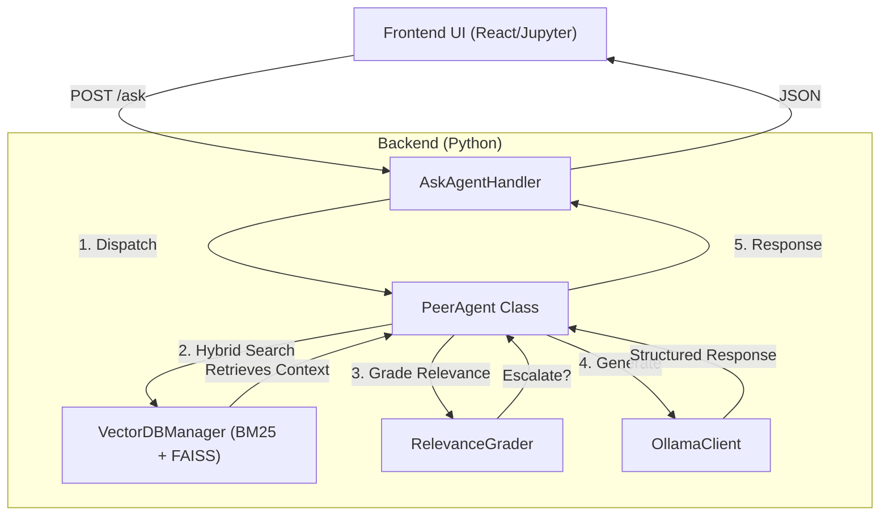
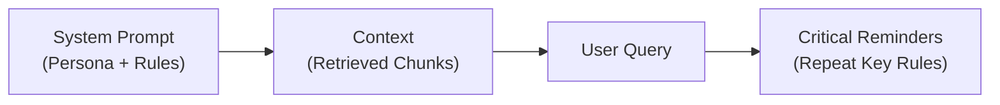
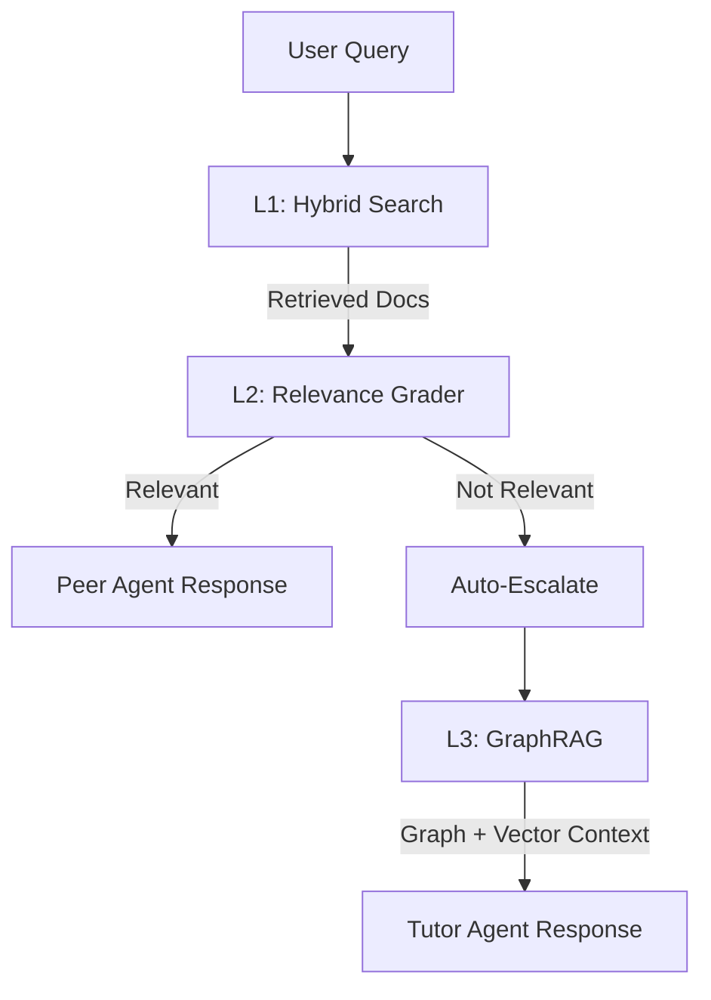
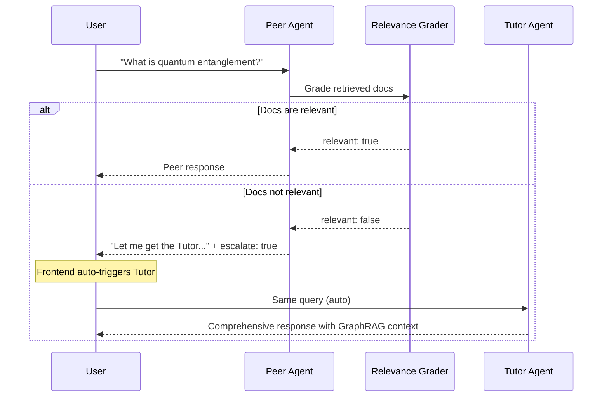
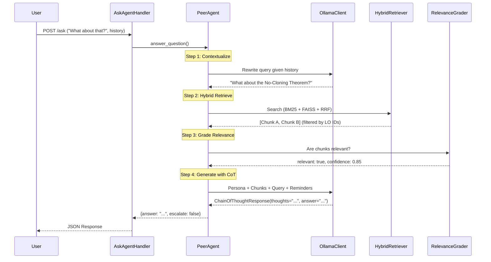

# Edu Agent Plugin Architecture

## 1. Overview

The `edu_agent_plugin` serves as the intelligent backbone of the Quantum Education Toolkit. It integrates Large Language Models (LLMs) and Retrieval-Augmented Generation (RAG) directly into the Jupyter environment to provide real-time, context-aware tutoring.

**Core Responsibilities**:
- **Dual-Agent System**: A peer-level study buddy and an expert tutor, each with distinct pedagogical roles.
- **Active RAG Pipeline**: A 3-layer retrieval architecture that routes queries based on content relevance.
- **Spoiler Prevention**: Filtering retrieved content to only include material the student has already studied.

---

## 2. System Architecture

The plugin follows a client-server architecture where the frontend (React/JupyterLab) communicates with a backend Python server (Tornado/Jupyter Server).



---

## 3. The Dual-Agent System

### Design Rationale

Educational psychology research shows that students are often intimidated by authority figures, which can inhibit question-asking behavior. Our solution is a **tiered agent system**:

1. **Peer Agent** (Primary): A friendly study buddy that lowers the barrier to asking questions.
2. **Tutor Agent** (Escalation): An expert instructor invoked when the Peer cannot adequately answer.

Both agents share the same backend logic (`PeerAgent` class) but receive different **persona prompts** that shape their behavior.

### A. The Peer Agent

| Attribute | Description |
|-----------|-------------|
| **Role** | Study buddy / fellow student |
| **Tone** | Conversational, humble, "in it together" |
| **Key Behaviors** | Uses analogies, admits ignorance, never lectures |
| **Retrieval** | Limited to content the student has completed |

### B. The Tutor Agent

| Attribute | Description |
|-----------|-------------|
| **Role** | Expert instructor / professor |
| **Tone** | Supportive, authoritative, comprehensive |
| **Key Behaviors** | Provides deep explanations, defines technical terms |
| **Retrieval** | Access to full course content + knowledge graph |

---

## 4. Prompt Engineering Strategy

### 4.1 Versioned Prompt Templates

Prompts are stored in YAML files with version tracking to enable:
- **A/B Testing**: Compare different prompt strategies systematically.
- **Rollback**: Revert to previous versions if regressions occur.
- **Documentation**: Each version includes metadata about its purpose.

```yaml
prompts:
  - version: "2.0"
    active: true
    description: "Chain-of-Thought with Sandwich Method"
    template: |
      You are a helpful study buddy...
```

### 4.2 Chain-of-Thought (CoT) Output Format

**Problem**: Smaller models (8B parameters) often skip reasoning steps, leading to hallucinations.

**Solution**: We enforce a structured output format that forces the model to "show its work":

```
THOUGHT: [Quote the relevant sentence(s) from the Course Notes]
ANSWER: [Your conversational response based on that quote]
```

**Why This Works**:
1. **Evidence First**: The model must identify supporting evidence before answering.
2. **Grounding**: Answers are anchored to specific quotes, reducing hallucination.
3. **Debuggability**: We can inspect the THOUGHT to understand model reasoning.

Implementation uses **Pydantic structured output** to guarantee JSON schema compliance:

```python
class ChainOfThoughtResponse(BaseModel):
    thoughts: str = Field(description="Thoughts on user query")
    answer: str = Field(description="Final answer")
```

### 4.3 The Sandwich Method

**Problem**: Long context windows cause "lost in the middle" phenomenon where models forget instructions placed at the start of prompts.

**Solution**: Place critical instructions both at the **start** (system prompt) and **end** (user message) of the prompt—like bread in a sandwich:



The final section reinforces:
- Do NOT repeat the question back
- Answer using ONLY the provided context
- Use the THOUGHT/ANSWER format

---

## 5. Active RAG Architecture

Traditional RAG retrieves documents and generates a response. **Active RAG** adds decision-making at each layer to improve response quality.



### Layer 1: Hybrid Search

**Problem**: Pure semantic search (embeddings) misses exact keyword matches. A query for "Bell State" might retrieve documents about "quantum states" but miss the specific page defining Bell States.

**Solution**: Combine BM25 (keyword) and dense vector search using **Reciprocal Rank Fusion (RRF)**.

| Component | Strength | Weakness |
|-----------|----------|----------|
| **BM25** | Exact term matching | Misses synonyms |
| **Dense (FAISS)** | Semantic similarity | Misses exact terms |
| **RRF Fusion** | Combines rankings | Configurable weighting |

**RRF Formula**:
$$RRF(d) = \sum_{r \in R} \frac{1}{k + rank_r(d)}$$

Where $k=60$ (standard constant) and $R$ is the set of ranking lists.

### Layer 2: Relevance Grading

**Problem**: Even with good retrieval, sometimes the documents are not relevant to the query. Generating from irrelevant context produces confabulation.

**Solution**: An LLM-based "router" that grades retrieval quality before generation.

```python
class RelevanceGrade(BaseModel):
    relevant: bool
    confidence: float  # 0.0 to 1.0
    reason: str
```

**Decision Logic**:
- If `relevant=True` → Peer Agent generates response
- If `relevant=False` → Return escalation flag, frontend triggers Tutor

### Layer 3: GraphRAG (Tutor Only)

**Problem**: Vector search captures document-level similarity but misses entity relationships across documents.

**Solution**: A **NetworkX knowledge graph** that stores entity-relationship triples extracted from course content.

**Triple Extraction**: Using LLM with structured output:
```
Content: "The No-Cloning theorem (1982) states quantum states cannot be copied."
Triples:
  - (No-Cloning Theorem, states, quantum states cannot be copied)
  - (No-Cloning Theorem, year, 1982)
```

**Local Search**: Given a query, find matching entities and traverse 1-2 hops to gather related facts.

**Why Graph + Vector?**
- Vector search: "What documents are about X?"
- Graph search: "What relationships does X have with other entities?"

---

## 6. Escalation Protocol

The system automatically escalates from Peer to Tutor based on retrieval quality:



**Additional Escalation Triggers**:
- No context retrieved at all
- User explicitly requests expert help

---

## 7. Spoiler Prevention

**Problem**: A student on Lesson 3 should not receive hints about Lesson 5 content.

**Solution**: Filter retrieved documents by **Learning Objective (LO) IDs** that the student has completed.

```python
# Peer Agent: Limited to completed content
context = db.filter_with_lo_ids(query, lo_ids=completed_lo_ids)

# Tutor Agent: Access to all content
context = db.filter_with_lo_ids(query, lo_ids=None)
```

This ensures the Peer Agent respects course progression while the Tutor can provide full explanations when needed.

---

## 8. Query Contextualization

**Problem**: Follow-up questions often use pronouns ("What about it?", "Can you explain that?") that are meaningless without conversation context.

**Solution**: Before retrieval, rewrite the query to be standalone using chat history.

**Example**:
```
History: [User: "What is BB84?", Agent: "It's a quantum key distribution protocol."]
New Query: "How does it prevent eavesdropping?"
Rewritten: "How does BB84 prevent eavesdropping?"
```

The rewrite uses a specialized prompt and is **cached** (LRU, 128 entries) to avoid redundant LLM calls for repeated questions.

---

## 9. API Endpoints

| Endpoint | Method | Purpose |
|----------|--------|---------|
| `/q-toolkit/ask` | `POST` | Main chat interface. Accepts `query`, `history`, `agent_type`. |
| `/q-toolkit/track_course` | `POST/GET` | Track and retrieve course progress (LO completions). |
| `/q-toolkit/vector_db` | `POST/GET` | Admin operations: reindex content, clear cache, inspect metadata. |

---

## 10. Data Flow Summary

Complete sequence for a follow-up question:


