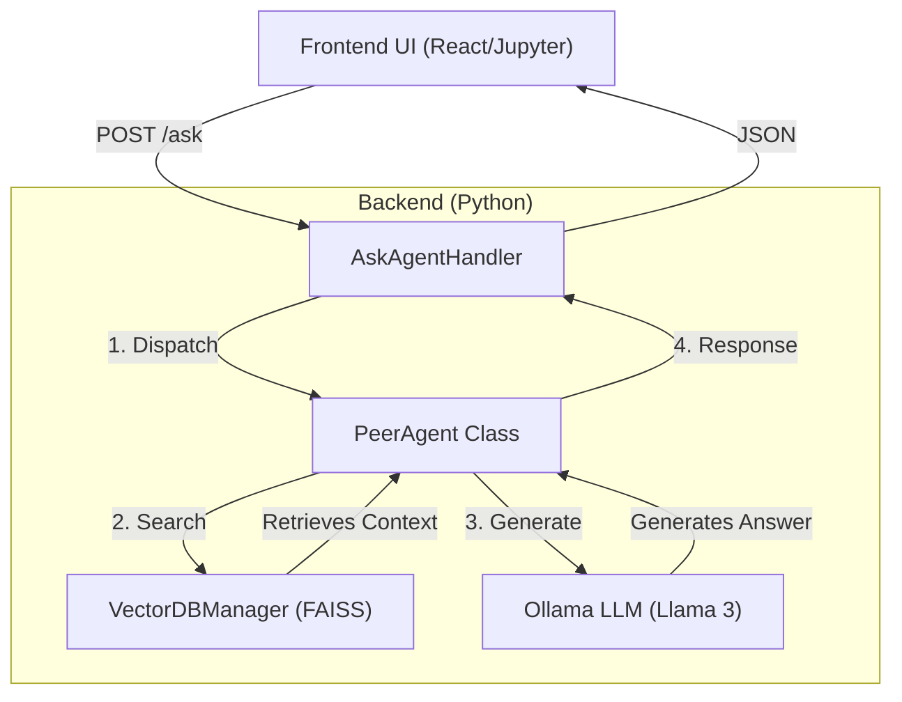
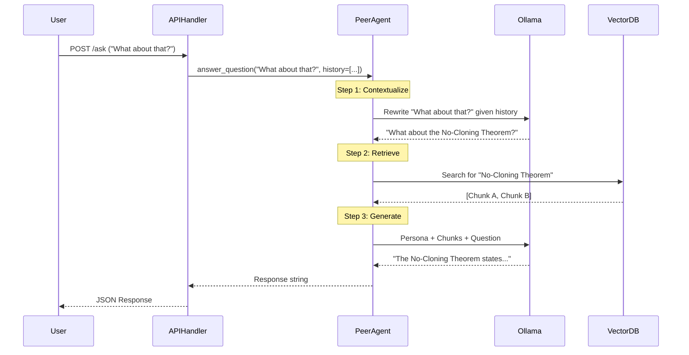

# Edu Agent Plugin Architecture

## 1. Plugin Overview
The `edu_agent_plugin` acts as the intelligent backbone of the Quantum Education Toolkit. It integrates Large Language Models (LLMs) and Vector Databases (RAG) directly into the Jupyter environment to provide real-time, context-aware assistance to students.

**Core Responsibilities**:
*   **Dual-Agent System**: Providing both a peer-level study buddy and an expert tutor.
*   **RAG Pipeline**: Retrieving relevant course notes to ground answers in fact.
*   **API Interface**: Exposing endpoints for the frontend chat UI and course tracking.

---

## 2. System Architecture

The plugin follows a client-server architecture where the frontend (React/JupyterLab) communicates with a backend Python server (Tornado/Jupyter Server).

---

## 3. The Agents

The system uses a single backend logic class (`PeerAgent`) that can switch "Personas" effectively creating two distinct agents.

### A. The Peer Agent (Default)
This agent is designed to lower the barrier to asking questions. It mimics a fellow student who is learning alongside the user.
*   **Role**: Study Buddy / Peer.
*   **Tone**: Conversational, humble, enthusiastic, "in it together".
*   **Key Behavior**:
    *   Uses analogies (e.g., Courier vs. Locked Box).
    *   Admits ignorance if the info isn't in the notes ("I don't think we covered that yet").
    *   Never lectures.
*   **Prompt Source**: `edu_agents.prompt.get_peer_prompt`

### B. The Tutor Agent (Escalation)
This agent is an expert authority, triggered when the user needs a deeper dive or explicitly asks for "Help" in a way that implies the Peer is insufficient.
*   **Role**: Professor / Expert Instructor.
*   **Tone**: Supportive, authoritative, comprehensive, precise.
*   **Key Behavior**:
    *   Provides detailed technical definitions.
    *   Explains the "Why" and "How" deeply.
    *   Uses the conversation history to build upon the Peer's previous answers.
*   **Prompt Source**: `edu_agents.prompt.get_tutor_prompt`

---

## 4. Technical Implementation Details

### API Endpoints (`handlers.py`)
The plugin registers custom handlers with the Jupyter Server:

| Endpoint | Method | Purpose |
| :--- | :--- | :--- |
| `/q-toolkit/ask` | `POST` | The main chat interface. Accepts `query`, `history`, and `derived_agent_type`. |
| `/q-toolkit/track_course` | `POST` | Marks specific LOs or Lessons as complete in the database. |
| `/q-toolkit/vector_db` | `POST` | Admin tools to re-index knowledge or clear the cache. |

### The RAG Pipeline (`v_db/peer_agent.py`)
The `answer_question` method is the heart of the logic:

1.  **Contextualization**:
    *   If there is chat history, the system first calls the LLM to **rewrite** the query.
    *   *Example*: User says "What about him?" -> Rewritten to "What about Alice's Eavesdropping?" based on history.
2.  **Retrieval**:
    *   The `VectorDBManager` searches the FAISS index for relevant course chunks.
    *   **Spoiler Prevention**: It filters results to only include content from *completed* or *current* Learning Objectives (LOs), ensuring students aren't given answers from future lessons they haven't unlocked.
3.  **Prompt Assembly**:
    *   `System Prompt` (Persona) + `Context` (Retrieved Chunks) + `User Query`.
4.  **Generation**:
    *   The assembled prompt is sent to `Ollama` (local LLM) to generate the final response.

### Vector Database (`v_db/vector_db_manager.py`)
*   **Engine**: FAISS (Facebook AI Similarity Search).
*   **Embedding Model**: `nomic-embed-text` (via Ollama).
*   **Indexing**: The `index_notebooks.py` script crawls the `content/` directory, extracts markdown and code cells, chunks them, and builds the index.

---

## 5. Data Flow Diagram

Sequence of a user asking a follow-up question:

