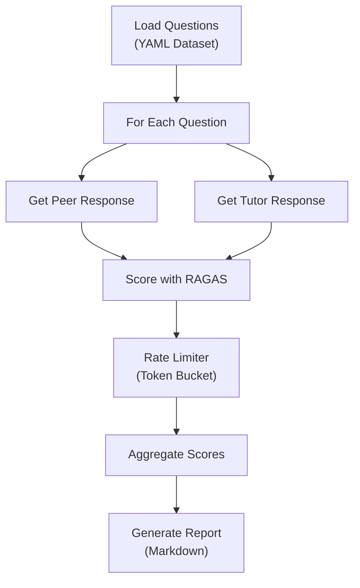

# Evaluation Methodology

## 1. Introduction

This document describes the methodology used to evaluate the quality of the **Peer Agent** and **Tutor Agent** in the Quantum Education Toolkit. The evaluation framework uses **RAGAS** (Retrieval Augmented Generation Assessment), an industry-standard library for evaluating RAG systems.

**Citation**:
> Es, S., James, J., Espinosa-Anke, L., & Schockaert, S. (2023). RAGAS: Automated Evaluation of Retrieval Augmented Generation. arXiv preprint arXiv:2309.15217.

---

## 2. Why Evaluate?

Educational AI agents must be evaluated to ensure they:

| Goal | Metric |
|------|--------|
| Provide accurate information (no hallucinations) | Faithfulness |
| Answer the question asked | Answer Relevancy |
| Use retrieved context appropriately | Context Precision |
| Retrieve all needed information | Context Recall |
| Match expected answers | Answer Correctness |

Without systematic evaluation, we cannot:
- Quantify improvement across prompt versions
- Identify weaknesses in retrieval or generation
- Compare Peer vs. Tutor agent effectiveness

---

## 3. The LLM-as-Judge Paradigm

### Why Use LLMs for Evaluation?

Traditional metrics (BLEU, ROUGE) measure surface-level text similarity but miss semantic correctness. An answer that paraphrases the reference perfectly would score poorly on exact-match metrics.

**LLM-as-Judge** uses a powerful language model to make nuanced judgments about:
- Semantic equivalence
- Logical consistency
- Factual accuracy

### How It Works

1. The evaluation LLM receives a structured prompt with the question, context, and answer.
2. It makes specific judgments (e.g., "List all factual claims in this answer").
3. These judgments are aggregated into numeric scores.

### Validated Reliability

Research shows LLM-based evaluation correlates highly with human expert judgments when:
- The judge LLM is more capable than the model being evaluated
- Prompts are structured to elicit specific, decomposed judgments

---

## 4. RAGAS Metrics

### 4.1 Faithfulness

**Definition**: Measures whether the generated answer is grounded in the retrieved context.

**Why It Matters**: Detects **hallucinations** where the model invents information not present in the source material. This is critical for educational agents where factual accuracy is paramount.

**Methodology**:
1. Extract all factual claims from the answer
2. Check each claim against the context
3. Calculate the ratio of supported claims

$$\text{Faithfulness} = \frac{\text{Claims supported by context}}{\text{Total claims in answer}}$$

**Range**: 0.0 (hallucinated) to 1.0 (fully grounded)

---

### 4.2 Answer Relevancy

**Definition**: Measures how relevant the answer is to the question asked.

**Why It Matters**: A factually correct answer that doesn't address the user's question is pedagogically useless.

**Methodology**:
1. Generate potential questions that the answer could address
2. Measure semantic similarity between generated questions and original question

**Range**: 0.0 (off-topic) to 1.0 (directly relevant)

---

### 4.3 Context Precision

**Definition**: Measures whether relevant chunks are ranked higher in the retrieved context.

**Why It Matters**: If the most useful information is buried at position 5, the model may not use it effectively. This diagnoses **retrieval ranking** quality.

**Methodology**:
$$\text{Precision@k} = \frac{\text{Relevant docs in top-k}}{\text{k}}$$

**Range**: 0.0 (relevant docs ranked low) to 1.0 (relevant docs ranked first)

---

### 4.4 Context Recall

**Definition**: Measures whether the retrieved context contains all information needed to answer.

**Why It Matters**: Identifies cases where the retrieval system failed to find relevant documents. Requires a **reference answer** to determine what information was needed.

**Methodology**:
1. Extract factual claims from the reference answer
2. Check how many are present in the retrieved context

$$\text{Recall} = \frac{\text{Reference claims in context}}{\text{Total reference claims}}$$

---

### 4.5 Answer Correctness

**Definition**: Measures semantic similarity between generated and reference answers.

**Why It Matters**: Validates that the agent provides accurate subject-matter information, independent of phrasing.

**Methodology**: Combines factual similarity (same facts?) with semantic similarity (same meaning?).

---

## 5. Evaluation Architecture



### 5.1 Execution Flow

1. **Load Dataset**: Questions from `evaluation_questions.yaml` with optional reference answers
2. **Generate Responses**: Query both agents with each question
3. **Score**: Run RAGAS metrics (async for performance)
4. **Rate Limit**: Respect API quotas for commercial LLMs
5. **Report**: Generate comparative markdown report

### 5.2 Configurable LLM Providers

The evaluation supports multiple LLM backends via environment configuration:

| Provider | Use Case | Cost |
|----------|----------|------|
| Ollama (local) | Development, unlimited testing | Free |
| OpenAI GPT-4 | Production evaluation, highest quality | API cost |
| Google Gemini | Alternative production option | API cost |
| Anthropic Claude | Alternative production option | API cost |

---

## 6. Rate Limiting

### The Problem

Commercial LLM APIs impose rate limits:
- **RPM** (Requests Per Minute)
- **TPM** (Tokens Per Minute)
- **RPD** (Requests Per Day)

Exceeding these causes failed evaluations and wasted API credits.

### The Solution: Token Bucket Algorithm

A **token bucket** accumulates capacity over time:
- Each API call consumes tokens from the bucket
- If empty, the call blocks until capacity refills
- Configurable limits per metric type

```
EVAL_RATE_LIMIT_RPM=15
EVAL_RATE_LIMIT_TPM=1000000
EVAL_RATE_LIMIT_RPD=1500
```

### Why This Approach?

1. **Smooth Distribution**: Prevents burst-then-wait patterns
2. **Configurable**: Different limits for different providers
3. **Transparent**: Logs when rate limiting is active

---

## 7. CLI-Based Filtering

### Selective Evaluation

Full evaluation across all questions and both agents is expensive. CLI filters enable targeted testing:

| Flag | Purpose | Example |
|------|---------|---------|
| `--question` | Evaluate specific question IDs | `--question Q1,Q3` |
| `--persona` | Evaluate specific agent | `--persona peer` |
| `--scenario` | For prompt rewrite tests | `--scenario S1` |

### Use Cases

- **Debugging**: Test a single failing question intensively
- **A/B Testing**: Compare agents on specific question types
- **Cost Control**: Limit API usage during development

---

## 8. Meta-Information Tracking

### Beyond Scores

Each evaluation captures metadata about the generation process:

```python
@dataclass
class EvaluationResult:
    question_id: str
    question: str
    agent_type: str
    answer: str
    contexts: List[str]
    faithfulness: float
    answer_relevancy: float
    # ...
    meta_info: Optional[Dict]  # NEW
```

### What's Tracked

| Field | Purpose |
|-------|---------|
| `thoughts` | Chain-of-Thought reasoning (from structured output) |
| `eval_duration_ms` | Token generation latency |
| `model_used` | Actual model version |

### Why Track This?

1. **Debuggability**: Inspect model reasoning when scores are low
2. **Latency Analysis**: Identify slow responses
3. **Reproducibility**: Know exactly which model produced results

---

## 9. Interpreting Results

### Score Interpretation

| Score Range | Interpretation | Action |
|-------------|----------------|--------|
| 0.9 - 1.0 | Excellent | None needed |
| 0.7 - 0.9 | Good | Monitor for regressions |
| 0.5 - 0.7 | Needs Improvement | Investigate prompts/retrieval |
| < 0.5 | Poor | Priority fix required |

### Comparative Analysis

The report includes Peer vs. Tutor comparison:

- **Win Rate**: Which agent scores higher more often?
- **Per-Metric Breakdown**: Is Tutor better at faithfulness but Peer at relevancy?
- **Question-Level Details**: Which specific questions cause failures?

---

## 10. Limitations

| Limitation | Impact | Mitigation |
|------------|--------|------------|
| **LLM Judge Bias** | Judge may favor certain phrasings | Use consistent judge across all tests |
| **Reference Quality** | Context Recall depends on good references | Expert-written reference answers |
| **Domain Specificity** | RAGAS designed for general RAG | Supplement with domain expert review |
| **Cost** | Commercial LLMs have API costs | Rate limiting + local Ollama for dev |

---

## 11. Prompt Rewrite Evaluation

A separate evaluation tests the **query contextualization** component:

**Objective**: Verify that follow-up questions are correctly rewritten to be standalone.

**Metrics**:
- Does the rewritten query preserve the original intent?
- Does it resolve pronouns/references correctly?
- Is the output a valid search query (not conversational)?

This uses a separate test (`test_prompt_rewrite.py`) with its own dataset of rewrite scenarios.

---

## 12. Running Evaluations

### Basic Usage

```bash
# Full evaluation (both agents, all questions)
pytest tests/test_agent_quality.py -v

# Single agent
pytest tests/test_agent_quality.py -v --persona peer

# Specific questions
pytest tests/test_agent_quality.py -v --question Q1,Q5

# Prompt rewrite tests
pytest tests/test_prompt_rewrite.py -v
```

### Output

Reports are generated in `tests/reports/` with:
- Per-agent summary scores
- Comparative analysis
- Question-level Q&A details with scores
