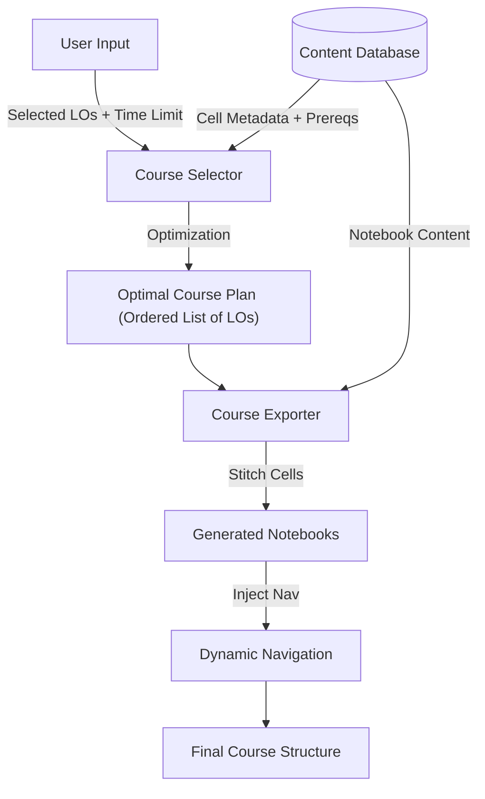
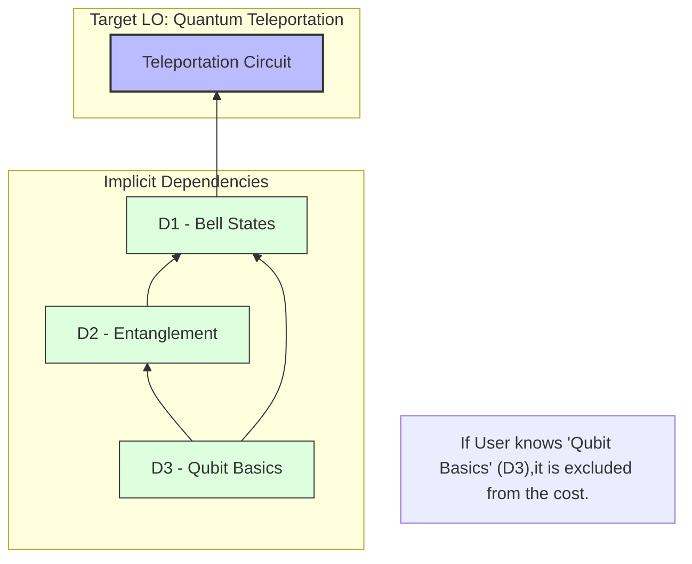

# Dynamic Course Generation Process

## 1. Introduction
The QEducationToolkit's Course Generator is a sophisticated engine designed to create personalized Quantum Computing learning paths. Unlike static course structures, this system dynamically constructs strict linear curriculums tailored to:
1.  **User Goals**: Specific Learning Objectives (LOs) the user wants to master.
2.  **Time Constraints**: Strict time budgets (e.g., "I have 20 minutes").
3.  **Prior Knowledge**: Skipping concepts the user already knows.
4.  **Learning Style**: Aligning content with experiential, conceptual, or reflective preferences (based on Kolb's Learning Cycle).

The core innovation is its **Cell-Level Granularity**. Rather than selecting entire pre-made modules, the system builds courses concept-by-concept, stitching together individual notebook cells to form a coherent narrative that fits the time budget exactly.

---

## 2. Theoretical Foundation

### The Set-Union Knapsack Problem (SUKP)
While often approximated as a 0/1 Knapsack problem, the problem is formally an instance of the **Set-Union Knapsack Problem (SUKP)**. This distinction is crucial because the "cost" of selecting multiple items is **non-additive**.

*   **Universe ($U$)**: The set of all available learning cells (the fundamental atomic units).
*   **Items ($S_j$)**: Candidate Learning Objectives (LOs). Each item $j$ corresponds to a subset of cells $S_j \subseteq U$ (the transitive closure of its prerequisites).
*   **Weights ($w_u$)**: Each cell $u \in U$ has a time cost $w_u$.
*   **Values ($v_j$)**: Each LO item $j$ has a value $v_j$.

**Objective**:
Select a subset of LOs $X$ to maximize total value, such that the sum of the weights of the *union* of their cells is within the budget $W$.

$$ \text{Maximize } \sum_{j \in X} v_j \quad \text{subject to } \sum_{u \in \bigcup_{j \in X} S_j} w_u \le W $$

**Key Implication**:
If Target A requires cells $\{1, 2\}$ and Target B requires cells $\{2, 3\}$, the cost of selecting both is $w_1 + w_2 + w_3$. We do not pay for cell 2 twice. This allows the system to efficiently bundle related concepts.

### Dependency Graph & Transitive Closure
Educational concepts form a Directed Acyclic Graph (DAG) where $A \to B$ means "Concept A is a prerequisite for Concept B".
*   **Cell-Level dependency**: Dependencies are tracked not just between modules, but between individual code/text cells.
*   **Transitive Closure**: To teach a target concept $T$, we must identify the entire subgraph of ancestors $P(T) = \{c \in \text{Cells} \mid c \to \dots \to T\}$.
*   **Cost Calculation**: The "cost" of a target $T$ is not just its own duration, but the sum of durations of all unique cells in $P(T)$ that are *not* already known by the user.

---

## 3. Core Logic & Algorithms

### A. Dependency Resolution
The system does not select "Courses"; it selects "Target LOs" and then resolves the minimal set of cells required to teach them.

#### Algorithm: Cell-Level Transitive Closure (DFS)
```python
def get_required_cells(target_cells, known_cells):
    required = set()
    visiting = set() # Cycle detection

    def visit(cell):
        if cell in known_cells or cell in required:
            return
        if cell in visiting:
            raise CycleError()
        
        visiting.add(cell)
        for prereq in cell.prerequisites:
            visit(prereq)
        visiting.remove(cell)
        
        required.add(cell) # Post-order add

    for target in target_cells:
        visit(target)
    
    return required
```
*   **Input**: A set of target cells from user-selected LOs.
*   **Output**: A topologically sorted list of all prerequisite cells required to understand the targets.
*   **Optimization**: This ensures we don't reteach known concepts.

### B. Subset Optimization Strategy
Since the number of user-selected goals is usually small (< 20), we can use an exact approach rather than heuristics for the Knapsack problem.

1.  **Generate Candidates**: Create all possible subsets of the user's selected LOs ($2^N$ combinations).
2.  **Evaluate Each Subset**:
    *   Resolve full cell dependencies for the subset (Union of all cell-level DAGs).
    *   Calculate `Total_Cost` = Sum of time estimates for unique required cells.
    *   Calculate `Total_Value` = Sum of relevance scores + Learning Style Bonus.
3.  **Filter**: Discard subsets where `Total_Cost > User_Budget`.
4.  **Select**: Pick the valid subset with the highest `Total_Value`.

### C. Fail-Safe: Partial Chain Fallback
If *no* complete subset of goals fits in the time budget (e.g., User wants "Shor's Algorithm" [60m] but has 20m), the system triggers a fallback:
*   It breaks the request down and tries to find the *single highest-value item* that fits.
*   It prioritizes giving *some* value over giving *nothing*.

---

## 4. Architecture & Data Flow

### High-Level Process Flow


### Dependency Resolution Visualization
How selecting one goal pulls in a web of dependencies:



---

## 5. Course Exporting Implementation

Once the optimal path is determined, the `Course Exporter` builds the physical artifacts (Jupyter Notebooks).

### 1. Dynamic Stitching
The system does not just copy files. It extracts specific *cells* from source notebooks.
*   **Source**: Master notebooks in `content/`.
*   **Selection**: only cells identified in the dependency resolution step.
*   **Transformation**:
    *   Image paths are rewritten to be absolute or relative to the new location.
    *   Metadata is injected.

### 2. Navigation Injection
To create a "Course" feel within Jupyter, custom navigation widgets are injected into every notebook.

**Injected Code Snippet:**
```python
# Auto-generated Header & Navigation
import ipywidgets as widgets
display(HTML(f"<h2>Lesson {i} of {n}: {Title}</h2>"))

def on_next_click(b):
    mark_complete(current_lo)
    window.location = next_lesson_url
```
This ensures that when a student finishes a notebook, their progress is tracked, and they are automatically redirected to the next concept in the chain.

---

## 6. Example Scenario

**Scenario**:
*   **User**: "I want to learn **Quantum Teleportation** (Target A) and **Superdense Coding** (Target B)."
*   **Time Budget**: 25 Minutes.
*   **Profile**: Visual Learner (Experiential).

**Data**:
*   Target A (Teleportation) requires: `[Cells: 1, 2, 3]` (Total 15m).
*   Target B (Superdense) requires: `[Cells: 2, 4]` (Total 10m).
*   *Note*: Cell 2 is shared (e.g., "Bell States").

**Execution**:
1.  **Subset {A, B}**:
    *   Union of Cells: `{1, 2, 3, 4}`.
    *   Total Cost: $15m + 10m - 5m (\text{shared}) = 20m$.
    *   **Result**: 20m <= 25m. **Valid**.
2.  **Selection**: The system selects both.
3.  **Generation**:
    *   Creates a course with ordered concepts: `Cell 1 -> Cell 2 -> Cell 3 -> Cell 4`.
    *   Since user is "Experiential", it prioritizes cells tagged with "Interactive" or "Code" where choices exist.
